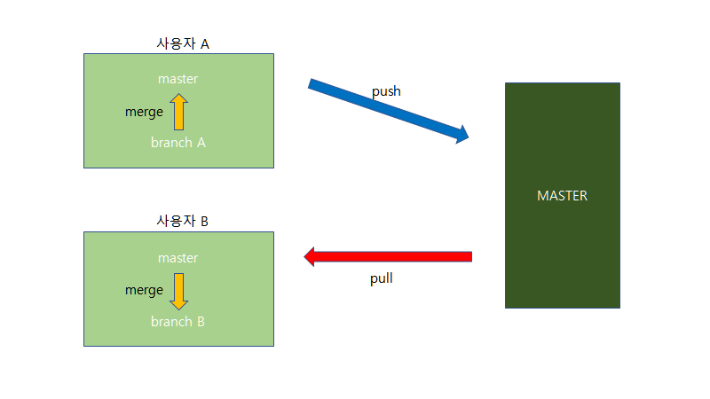
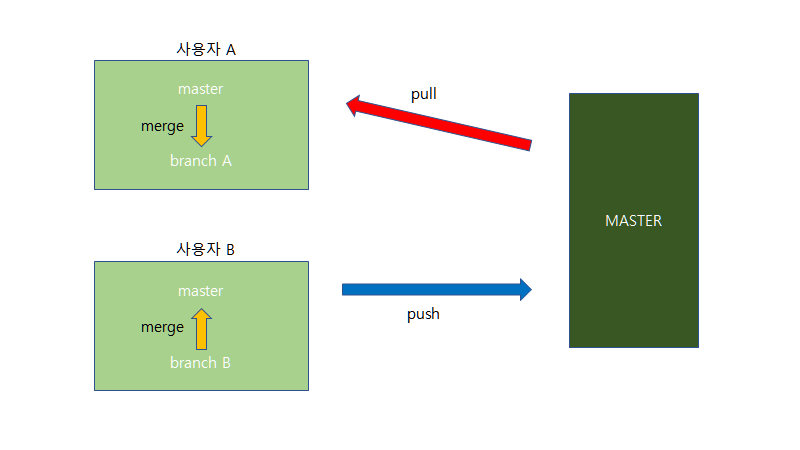

---

### Project 만들기 1편

중고 시장의 활성화를 위해 중고 물품을 거래할 수 있는 사이트를 만들기로 정했다.

개발 환경: Spring, JAVA, MySQL... 그리고 Github

Github으로 주고 받기를 해보자!

순서

1. repo를 만든다.

2. 팀원들을 초대한다.

3. 팀원들은 각각 본인이 작업할 branch(a, b, c)를 개설한다.

   (총 branch 수는 팀원 수 + 1(MASTER브랜치) )

여기까지가 기본 설정

다음으로 주고 받기를 하기 전에 확인

##### 내가 가진 master와 repo의 MASTER를 구분 표기한다.

Github: MASTER, 팀원별 브랜치 a, b, c

나: master, 브랜치 a

###### 내가 MASTER에 있는 내용을 받아올 때

master 브랜치에서 MASTER를 pull 해온다.

커밋한 후 a 브랜치로 이동한다.

a 브랜치에서 master 브랜치를 merge 한다. (기존에 작업내용 있을 경우 먼저 커밋한다?)

→  a 브랜치에 MASTER에 있던 내용이 들어온다.

###### 내가 MASTER로 작업한 내용을 올릴 때

 a 에서 작업

커밋, push 작업을 하고 master 브랜치로 이동한다.

master 브랜치에서 MASTER를 pull 해 온다.

master 브랜치에서 a 브랜치를 merge 한다.

master 브랜치를 commit 하고 push 해준다.

→ MASTER 브랜치에 내가 작업한 내용이 들어간다.

서로 이렇게 받아오고 올려주는 작업을 하면 된다..! 