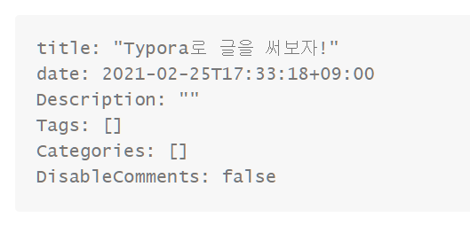

### 이번 포스트는 TYPORA

블로그는 만들었다. 

글을 써야하는데 글은 어떻게 쓰지?

빠르게 고고

휴고에서 포스트들을 만들어 제목은 볼 수 있는데 내용은 어떻게 입력해야하지?

마크다운은 써 본 적이 없는데.. 검색하니 TYPORA를 주로 많이 쓴다고 했다.

TYPORA를 바로 설치했다.

md 파일을 열면 

이렇게 화면이 나타난다.

title에서 제목을 수정하고 아래 흰 바탕에 글을 작성하면 된다

그 외 갖가지 기능은 typora 홈페이지를 참고하자! #이라던지 >라던지 하는 단축키들을 사용해서 문서를 작성할 수 있다! 