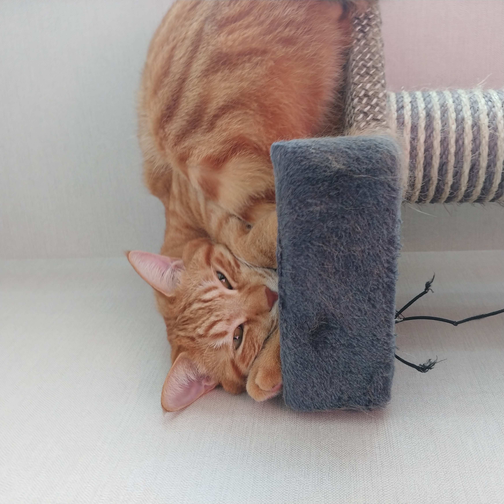
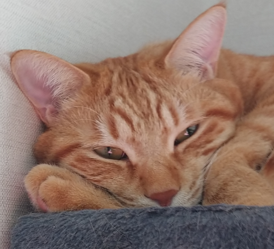
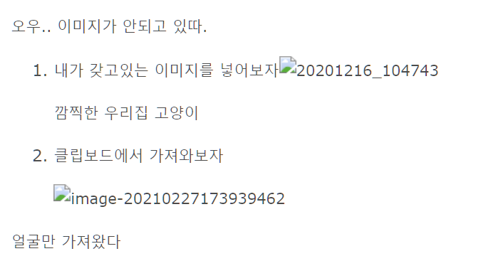

---

### 이미지를 넣어보자

오우.. 이미지가 안되고 있따.

1. 내가 갖고있는 이미지를 넣어보자

   깜찍한 우리집 고양이

2. 클립보드에서 가져와보자

   

얼굴만 가져왔다

자 이제 빌드한다. 어떻게 될까.. 

실패했다.

환경설정을 좀 바꾼 다음 다시 시도한다.

어떻게 될까.

안들어가졌다. 이미 들어가 있는 프로필에 이미지랑 뭐가 다를까 싶어 살펴봤다. 

https://jinju0809.github.io/images/profile.jpg 프로필 사진에 걸린 링크

../../static/images/20201216_104743.jpg 깜찍이에게 걸린 링크.. 완전 다르구만. 

https://tkim.info/ko/hugo/h053-hugo%EC%99%80-typora-%EC%97%B0%EA%B2%B0%ED%95%B4%EC%84%9C-%EC%93%B0%EA%B8%B0/

검색하다가 이 블로그를 보고 따라해보았다. 

images/image-20210227173939462.png

https://jinju0809.github.io/images/profile.jpg

와아아이~~ 이제 된다~~~